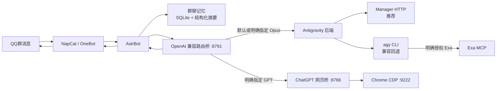

# Termux Multi-Model QQ Bot

一个运行在 Android/Termux 上的完整 QQ 群聊 AI 机器人系统。项目把 NapCat、AstrBot、Antigravity Manager/CLI 路由桥和 ChatGPT 网页桥串成一条可长期运行的链路，并加入群聊记忆、显式模型路由、网页搜索授权、图片回传、长回复整理、延迟观测和进程守护。

本仓库以 2026-08-01 从 Redmi 生产手机只读导出的代码为准。公开版本已经移除 QQ 号、Cookie、OAuth 状态、API Key、聊天数据库、日志、二维码、浏览器 Profile、模型会话记录和运行缓存；手机上的生产代码没有因为本次发布而被修改或重启。

PDF 项目报告：[paper/main.pdf](paper/main.pdf)。v0.2.0 报告基于脱敏后的 WorkBuddy 工程记录，补充九类真实故障、性能测量、超时链和恢复设计；原始会话与隐私数据不进入公开仓库。

## 系统结构



完整说明见 [PROJECT_ARCHITECTURE.md](PROJECT_ARCHITECTURE.md)。

## 已实现功能

- NapCat 接入 QQ，AstrBot 负责事件管线、插件、工具调用和消息发送。
- OpenAI 兼容桥可把 AstrBot 请求原生转发到 Antigravity Manager HTTP，并保留 Antigravity CLI 交互式终端作为兼容回退。
- Manager 后端直接保留 OpenAI 消息、工具定义和工具调用，不再依赖手机上的 OAuth/TUI 会话文件。
- 持久化 PTY 会话复用同一对话，后台持续排空终端输出，并对写入背压、提交、生成进度和取消进行检测。
- 用户明确要求 `Opus` 或 `GPT` 时按模型隔离会话并路由；后台记忆压缩任务不会误入高成本模型。
- 用户明确要求 Exa 时允许 Antigravity 调用 Exa MCP；普通“搜索一下”只允许内置搜索。
- ChatGPT 网页桥通过 Chrome DevTools Protocol 控制已登录页面，支持多轮复用、分块粘贴、错误重试、图片下载和 OpenAI 风格返回值。
- 群消息写入本地 SQLite；默认保留最近 18 条原文，每 30 条形成一批结构化摘要，安静 90 秒后异步压缩，并提供历史搜索工具。
- 长消息按 UTF-8 字节安全拆分为 QQ 合并转发节点，避免单节点过大导致整条回复发送失败。
- 延迟探针和 Termux 守护脚本记录各链路耗时，监测 AstrBot、路由桥、ChatGPT 桥、Chrome CDP 与 QQ 登录状态。

## 仓库目录

```text
astrbot/                         AstrBot 核心与本项目修改
bridges/antigravity/             Antigravity/Codex OpenAI 兼容桥
bridges/chatgpt-web/             ChatGPT 网页 CDP 桥
deployment/termux/               Termux 启动、守护与监控脚本
deployment/vps/                  Manager 单模型受限 API 网关与 systemd 模板
plugins/astrbot_plugin_latency_probe/
                                 链路延迟观测插件
paper/                           Typst 项目报告与 PDF
tests/                           AstrBot 与桥接单元测试
publish.json                     GitHub/个人主页发布元数据
```

## 环境要求

- Android 设备与 Termux 0.118 或兼容版本
- proot Ubuntu，Python 3.12，Node.js 20+
- NapCat 与 Linux QQ（外部依赖，本仓库不打包）
- Antigravity Manager（推荐）或 Antigravity CLI（兼容回退，均需用户自行登录）
- Chromium/Chrome，开启本机 CDP 端口时才需要 ChatGPT 网页路由
- AstrBot Python 依赖，以及桥使用的 `pexpect`、`pyte`、`quart`

## 部署概要

1. 在 Termux 中安装 proot Ubuntu、NapCat、Node.js 与 Chromium，并分别完成 QQ、Antigravity 和 ChatGPT 登录。
2. 将本仓库放到 Ubuntu 的 `/root/AstrBot`，将 `bridges/antigravity/` 放到 `/root/antigravity-bridge`。
3. 将 `bridges/chatgpt-web/` 放到 Termux 的 `$HOME/chatgpt-web-codex-bridge`，在该目录运行 `npm ci`。
4. 复制并按需修改 [deployment/termux/bot-stack.env.example](deployment/termux/bot-stack.env.example)，只在手机本地设置账号和路径变量。
5. 在 AstrBot WebUI 中配置 OpenAI 兼容提供商：基础地址为 `http://127.0.0.1:8791/v1`，模型名为 `antigravity`。API Key 字段只填本地占位值，不要提交真实凭据。
6. 启动 NapCat、ChatGPT 网页桥、Antigravity 桥和 AstrBot；可使用 `deployment/termux/` 中的守护脚本。

从 CLI 迁移到 Manager、远程 Docker OAuth、动态发现 Gemini 3.7 Flash，以及创建只能调用单一模型的分享 Key，见 [docs/ANTIGRAVITY_MANAGER_MIGRATION.md](docs/ANTIGRAVITY_MANAGER_MIGRATION.md)。

手机路径、Android 厂商后台限制和登录方式差异较大，因此首次部署仍需逐层验证。详细端口与健康检查见 [PROJECT_ARCHITECTURE.md](PROJECT_ARCHITECTURE.md)。

## 本地开发与验证

AstrBot 核心：

```powershell
uv sync
uv run pytest tests/unit/test_antigravity_openai_bridge.py tests/unit/test_antigravity_flash_gateway.py tests/unit/test_codex_openai_bridge.py tests/unit/test_group_memory.py tests/unit/test_runtime_error_visibility.py
uv run ruff format --check .
uv run ruff check .
```

ChatGPT 网页桥：

```powershell
cd bridges/chatgpt-web
npm ci
node --check code/src/chat-bridge.mjs
```

构建 PDF：

```powershell
typst compile paper/main.typ paper/main.pdf --root .
```

## 安全与合规

- 服务默认只监听 `127.0.0.1`，不要直接暴露到公网。
- 不要把 Manager 的主 API Key 分享给第三方；需要分享时使用受限网关，并且只通过 HTTPS 对外提供。
- Google 官方 `agy` 是优先路径；第三方 Manager/API 代理可能触发服务条款或账号风控，启用前请阅读其项目警告并自行评估风险。
- 不要提交 `data/`、Cookie、浏览器 Profile、OAuth 文件、二维码、日志、数据库或任何 API Key。
- NapCat、Antigravity、ChatGPT 与 Exa 都是外部服务或软件，请自行遵守各自许可与服务条款。
- ChatGPT 网页自动化是非官方、易受页面变化影响的实验性方案；稳定生产环境应优先使用官方 API。

详见 [SECURITY.md](SECURITY.md)。

## 上游与许可

本项目包含基于 [AstrBot](https://github.com/AstrBotDevs/AstrBot) 的修改版运行时，保留其许可证、EULA 与首次通知文件。仓库整体按 [GNU AGPL-3.0](LICENSE) 发布；NapCat、Antigravity CLI、Chrome/Chromium、ChatGPT 和 Exa 不随本仓库分发，其许可分别由对应项目或服务决定。

## 发布信息

- GitHub：<https://github.com/3099404236/termux-multimodel-qq-bot>
- 项目主页：<https://3099404236.github.io/publications/termux-multimodel-qq-bot.html>
- 在线 PDF：<https://3099404236.github.io/papers/termux-multimodel-qq-bot-v0.2.0.pdf>
- 版本：`v0.2.0`
- 快照日期：2026-08-01
- 分类：应用系统
